# Journal
## Product Configuration - Interactive 3D Graphics
## Andrea Mansi UNIUD 2020

---

---
#### Giorno 1: 07/2/2020

- Scelta della tipologia di prodotto
- Specifica dei requisiti
- Pianificazione del progetto (stesura di una prima bozza di roadmap, contenente le fasi principale per completare il progetto.)

REQUISITI [ver 1]

| ID | Requisiti principali |
| :---:        |    :----:   
| 1 | La pagina web deve  visualizzare un oggetto 3D composto da diversi materiali|
| 2 | L'utente deve poter ruotare l'oggetto o la visuale |
| 3 | L'utente deve poter selezionare di quale materiale deve essere composta una specifica parte dell'oggetto |
| 3A | deve quindi poter selezionare la parte su cui agire |
| 3B | deve quindi poter selezionare il nuovo materiale |
| 4  | il sistema deve garantire buone performance su dispositivi mobili |

ROADMAP [ver 1]
| n° | Task | Priorità|
| :---:        |    :----:   | :---: |
| 1 |Modellazione di un prodotto composto da più parti da usare come test per le fasi successive.| Principale |
| 2 |Implementazione di un sistema che permetta di cambiare agevolmente il materiale di una |Principale |determinata parte del prodotto.|Principale |
| 3 |Implementazione di una GUI che permetta di interagire con il codice a run-time.|Principale |
| 4 |Ideazione del sistema di illuminazione|Principale |
| 5 |Ideazione di vari materiali per configurare il prodotto |Principale |
| 6 |Modellazione del prodotto finale |Principale |
| 7 |Creazione del sistema finale: luci, prodotto, GUI etc. |Principale |
| 8 |Sistema per il controllo delle luci | Opzionale |

### Lavoro svolto:

- Scelta del prodotto finale
- Scelta del software di modellazione e successiva creazione di un primo modello composto da 2 mesh come punto di partenza.
  - software scelto: Blender
- Strutturazione del codice iniziale, importazione del modello tramite GLTF.loader e prime sperimentazioni con l'assegnazione/cambiamento del materiale dei vari mesh

Primo modello di test

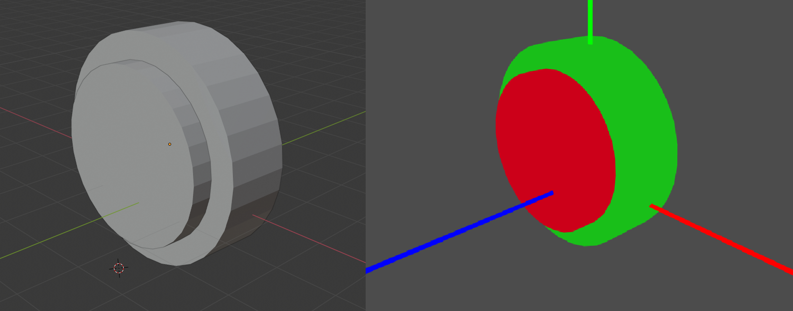

Funzione di assegnazione di un nuovo materiale a una specifica parte del modello:

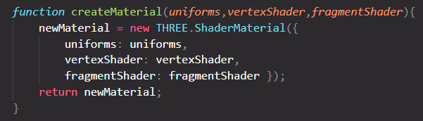

Funzione per creare dinamicamente nuovi materiali una volta selezionati vertex e fragment shaders:

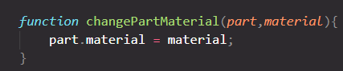

---
---
#### Giorno 2: 08/02/2020

### Lavoro svolto:
- Implementazione BRDF Lambertiana + Microfacets
- Modellazione del primo prototipo di modello
- Primi test di rendering

Immagini del primo modello:

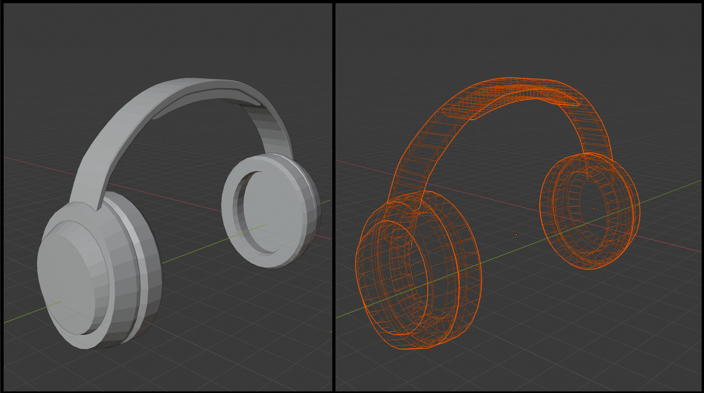
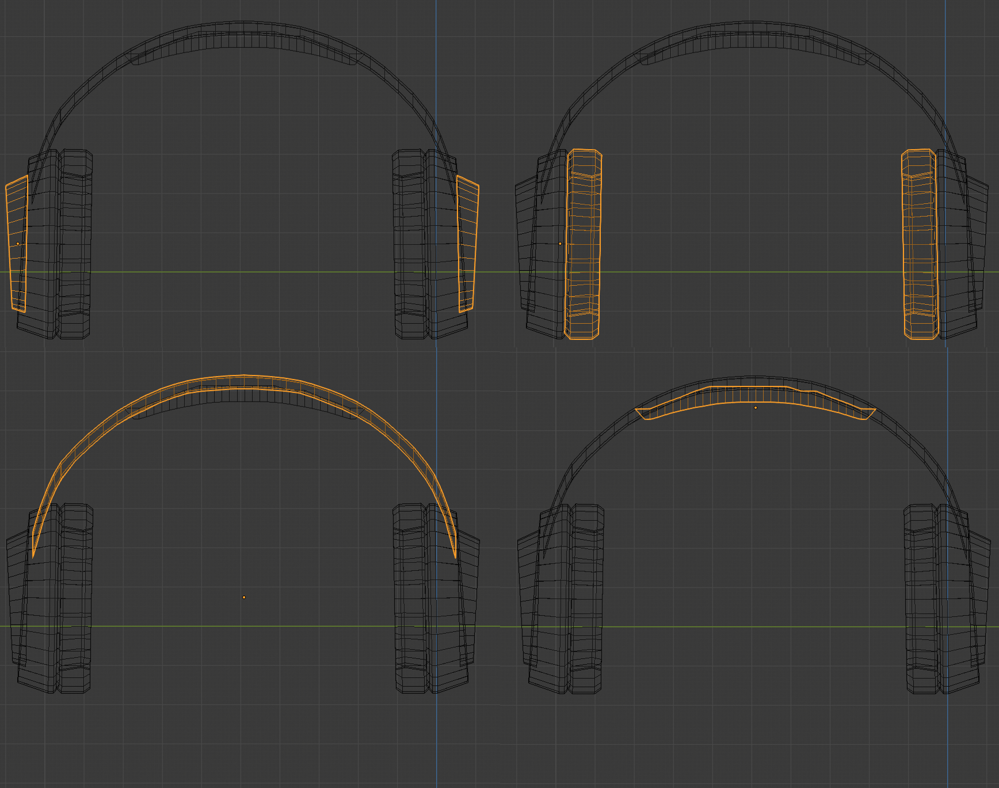

Immagine del primo test di rendering (plastica opaca e lucida):

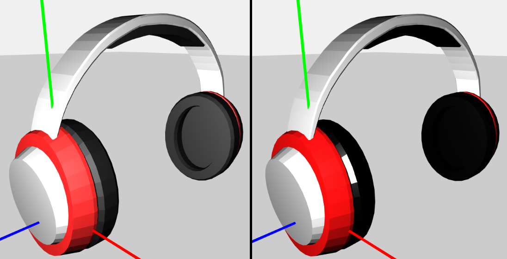

---
---
#### Giorno 3: 10/02/2020
- Aggiunta di una cubemap

- Implementazione della prima GUI per interagire con l'oggetto tramite la liberaria di THREE.JS

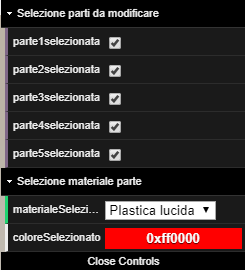

- Implementato un sistema che interagisce con la GUI e cambia a run-time le modifiche dell'utente sui materiali

- Pulizia del codice
  
---
---
#### Giorno 4: 13/02/2020

- Creazione del modello finale

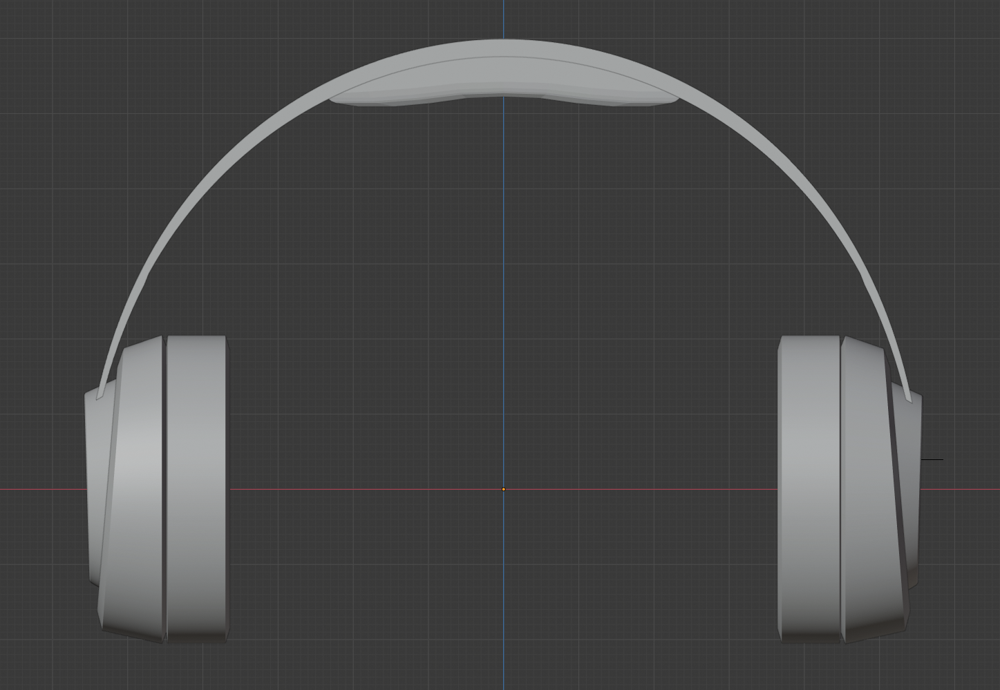

- Creazione di due nuovi materiali con la BRDF Lambertiana + Microfacet: Oro e Alluminio
- Implementazione dello Shader (vertex+fragment) per riflettere la luce della cubemap ("glossy reflection shader")

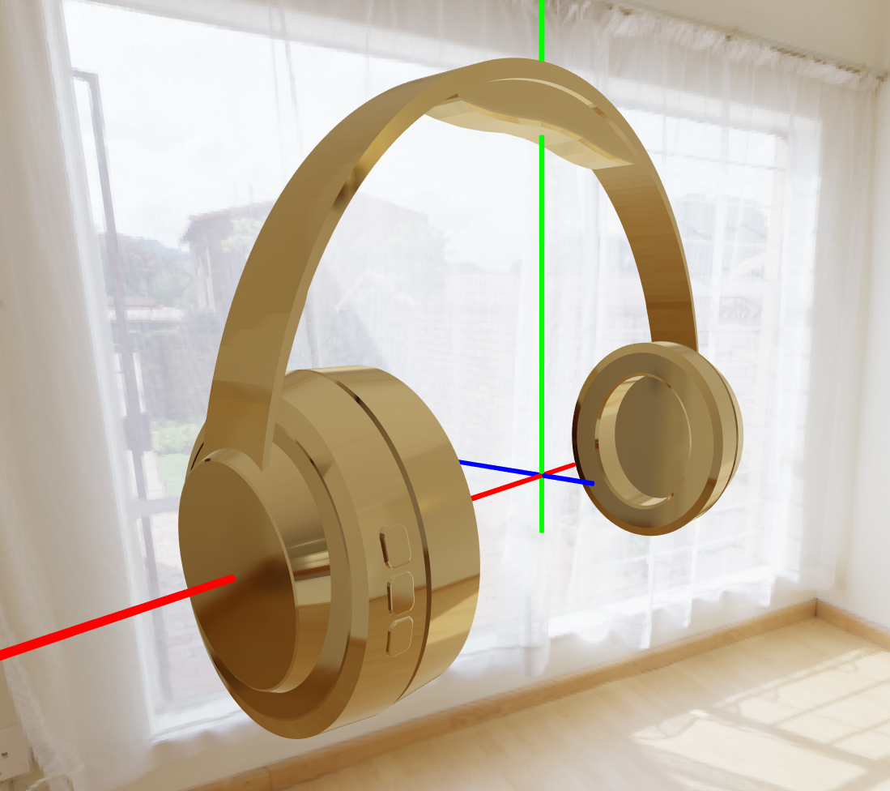

- Miglioramento della gui e refactoring del codice

---
---
#### Giorno 5: 15/02/2020

- Modifica di alcune parti del modello, cause problemi con tangenti e normali in fase di fragment shading
- Aggiornamento della GUI e modifiche sparse sul codice
- Aggiunta del materiale Alluminio e Argento
- La GUI ora non viene istanziata con parametri di default ma coerenti con la configurazione iniziale del modello
- Implementata la possibilità di aggiungere una cubemap ai materiali che utilizzano lo shader glossy (si prevede di unire i due shader: glossy + lambert così da poter illuminare l'oggetto sia dalla cubemap che da eventuali luci aggiuntive.)
  

---
---
#### Giorno 6: 16/02/2020

- Unito il comportamento dello shader glossy e quello lambertiano:
  - Il risultato è uno shader che permette di illuminare l'oggetto con la cubemap, di passare una normalMap, inoltre permette di illuminare l'oggetto con ulteriori luci presenti sulla scena.
  Il risultato è osservabile nell'immagine sottostante.
    - (a) Shader glossy reflection from cubemap
    - (b) Riflessi speculari di 3 luci presenti nella scena
    - (c) La somma dei due risultati

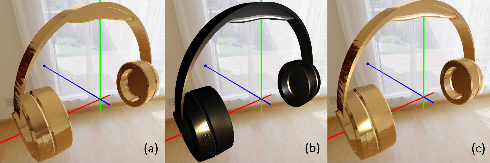

- Refactoring del codice e miglioramento dei materiali già presenti (ovvero: oro,alluminio,argento, 2 tipologie di plastiche di qualsiasi colore: opaca e lucida).

- Segue una serie di alcuni rendering:
  
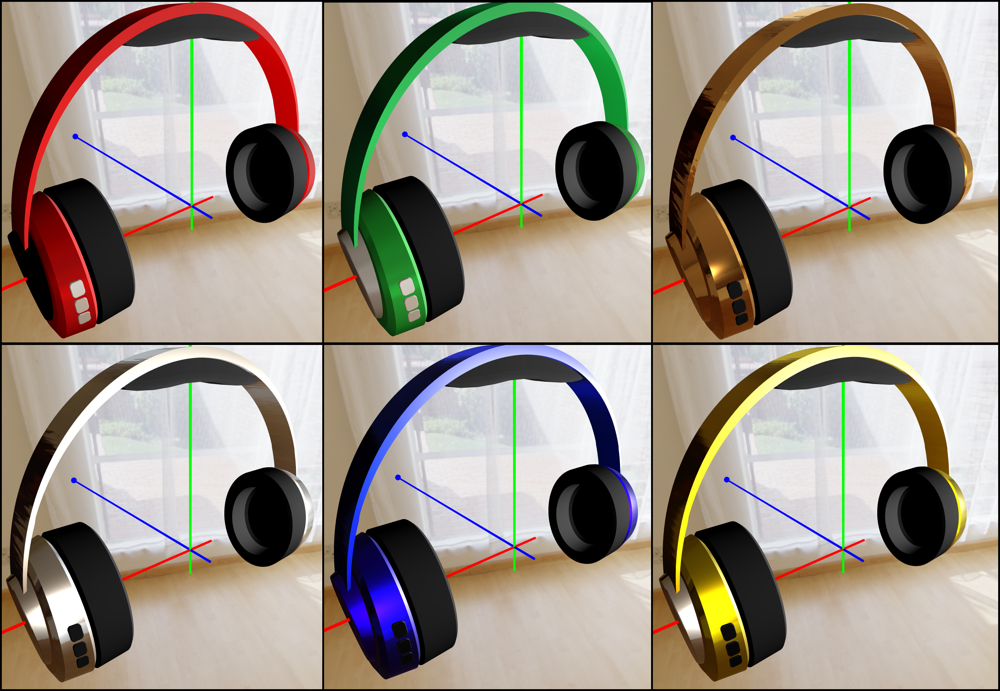

---
---
#### Giorno 6: 17/02/2020

- Tweaks finali del modello
- Aggiunta di due cubemaps, l'utente può swhitchare tra una e l'altra a run-time e i materiali vengono aggiornati
- Aggiunta di un modello schematico di "manichino"
- Creazione di due materiali possibiliper le componenti ergonomiche (padiglioni + supporto testa) che ovviamente non possono essere in plastica/metalli: tessuto bianco e scuro con relativa normalmap
- Selezionate normalmap differenti per alluminio/oro/argento
- tweaks sulle 3 luci della scena per ottimizzare l'illuminazione dell'oggetto oltre alla luce dell'env.

- Segue una serie di alcuni render con le modifiche apportate:

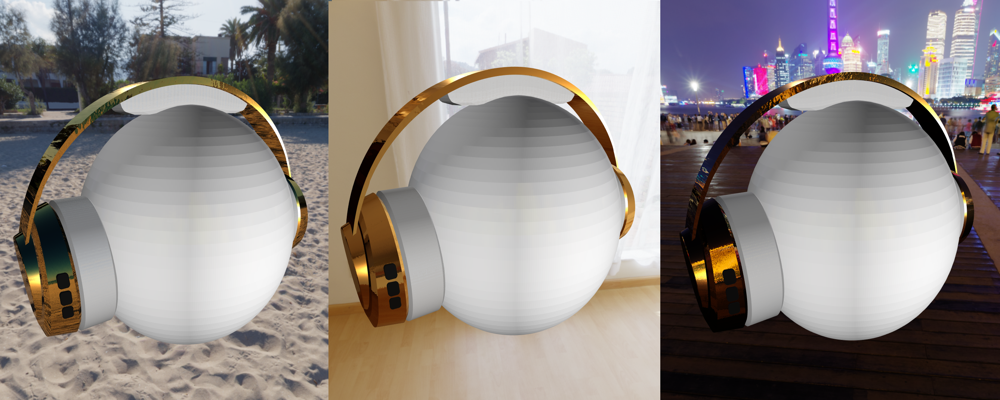

---
---
#### Giorno x: xx/02/2020

---
---
#### Giorno x: xx/02/2020

---
---
#### Giorno x: xx/02/2020

---
---
#### Giorno x: xx/02/2020

